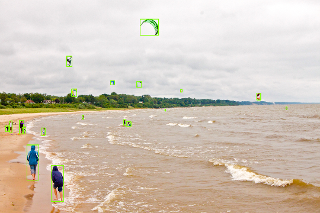
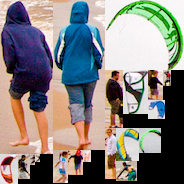

<h1 align="center">
  
</h1>
<h4 align="center"> (roi   &   roi-layout) </h4>

<h3 align="center">
  Redeploy the roi extracted from the large image to the small image.
</h3>

## Description

In the field of computer vision, there is often too much redundant information in large images. After preprocessing, the areas of human interest are relatively scattered, which is not conducive to centralized processing. We redeploy these areas to facilitate subsequent centralized processing.

## Getting Started

### Requirements


    ubuntu == 16.4
    opencv == 3.3.1


### Building && run

To build && run:

```
$ mkdir build && cd build
$ cmake .. && make -j8
$ ../bin/roi_layout
```

### Developing

 If you want to get a different deployment shape, just fix the following sentence, otherwise you can ignore this operation.

Function [void ROILayout::FindBestLocation(Rect &rect)] in ROI_layout.cpp:
```c++
  float score = ratio_wh * ratio_area;  // Can be customized.
```
## License

This project is licensed under the MIT License - see the
[LICENSE.md](LICENSE.md) file for details.

## Citation

Please cite roi-layout in your publications if it helps your research:

    @misc{roi_layout,
        Author = {niovl},
        Title = {{roi-layout: Redeploy the roi Extracted From the Large Image To the Small Image.}},
        Howpublished = {\url{https://github.com/niovl/roi_layout}},
        Year = {2020}
    }
