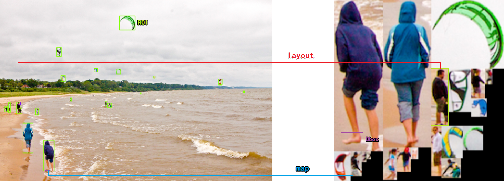
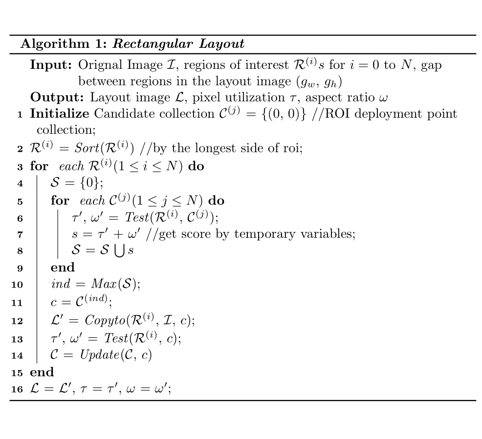

<h1 align="center">

</h1>
<h4 align="center"> (Roi Layout & Bbox Map) </h4>

<h3 align="center">
  Redeploy the roi extracted from the large image to the small image.
</h3>

## Description

In the field of computer vision, there is often too much redundant information in large images. After preprocessing, the areas of human interest are relatively scattered, which is not conducive to centralized processing. We redeploy these areas to facilitate subsequent centralized processing.

## note
<h1 align="center">

</h1>

## Getting Started

### python 3.5
* 1.Requirements
    ```
    opencv-python
    numpy
    ```
    
* 2.Useage && Developing

*see python/demo.py*

### C++
* 1.Building && run

```
# opencv == 3.3.1
$ mkdir build && cd build
$ cmake .. && make -j8
$ ../bin/roi_layout
```

* 2.Useage && Developing

- **How to get layout rects?** use get_layout().
- **How to get layout image?** use get_layout_mat().
- **How to infer layout result?** use TryLayout().
- **How to map box in layout image to orignal image?** use MapLayoutBoxToROI().


 If you want to get a different deployment shape, just fix the following sentence.

```c++

  /**
   * ROI_layout.cpp
   * void ROILayout::FindBestLocation(Rect &rect)
  **/
  float score = ratio_wh * ratio_area;  // Can be customized.

```

## License [](LICENSE)
This project is licensed under the MIT License - see the
[LICENSE.md](LICENSE.md) file for details.

## Citation

Please cite roi-layout in your publications if it helps your research:

    @misc{roi_layout,
        Author = {niovl},
        Title = {{roi-layout: Redeploy the roi Extracted From the Large Image To the Small Image.}},
        Howpublished = {\url{https://github.com/niovl/roi_layout}},
        Year = {2020}
    }
